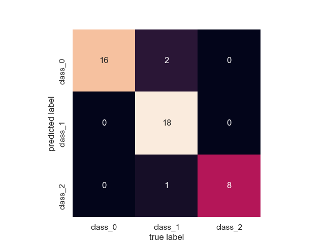

# Atividade Avaliativa - Tópicos Especiais

O programa usa o método de aprendizado: 
1. [GaussianNB](https://scikit-learn.org/stable/modules/generated/sklearn.naive_bayes.GaussianNB.html)

# Dataset

Referência:  [Link para o site do sklearn](https://scikit-learn.org/stable/modules/generated/sklearn.datasets.load_wine.html)

| Título | Valor |
| :---: | :---: |
| Classes | 3 |
| Amostras por Classe | [59,71,48] |
| Amostras Totais | 178 |
| Amostras para Treino | 133 |
| Amostras para Teste | 45 |

# O Programa

Inicialmente importamos o sklearn, e dele importamos os métodos de aprendizado. Carregamos o dataset pronto baseado em classes que definem a gravidade de um caso de diabetes e atribuímos os parâmetros e dados dele às variáveis do nosso programa, logo em seguida implementamos a função ```train_test_split()``` para dividirmos em arrays de treino e de teste, passando os dados e a porcentagem do array de dados direcionados à testes.
Instanciamos os métodos de aprendizado e a partir da predição feita pelos métodos, geramos e exibimos a acurácia através da função ```accuracy_score()```

# Métricas e Desempenho

Para compor as métricas das predições pós treinamento do nosso algoritmo de aprendizado de máquina supervisionado, foi utilizada a matriz de confusão padrão do SKLearn. Podemos inferir através dessa matriz que os resultados foram muito próximos ao que se esperava tendo apenas 3 erros de 45 predições. A melhor eficiência que obtivemos foi na predição da classe 1
(class_1) na qual todos os 18 resultados foram corretos. Segue a imagem da matriz obtida no código através do comando abaixo.
```
plt.savefig("out.png")
``` 




# Participantes

* Guilherme Quittó - PT3001385
* Jonathan Dias dos Santos - PT300208X
* Luiz Henrique Marinelli dos Santos - PT3006042
* Leonardo Lotaif - PT3001458
* Matheus Vinicius de Souza Gomes - PT3001369
